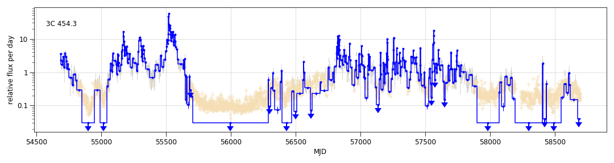
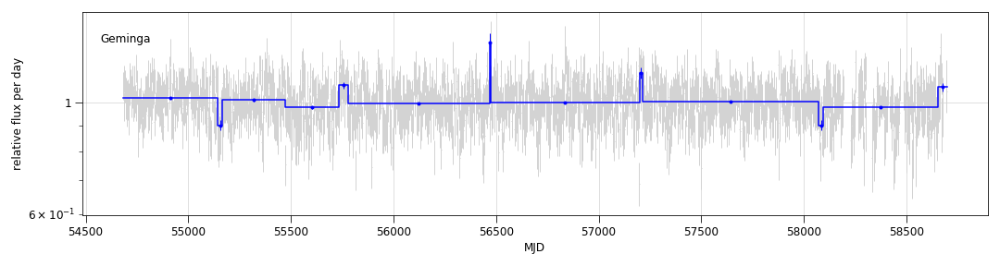
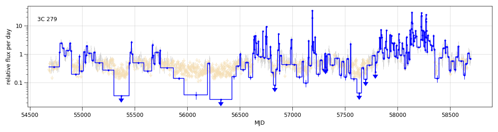
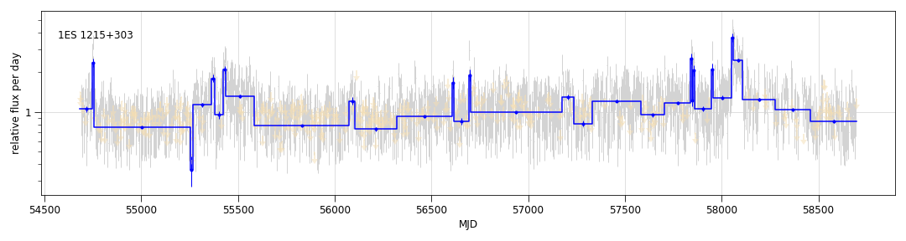

# Develop and apply code for timing of Fermi-LAT sources

## Example light curves:

These use 11 years of data, with 1-day measurments, or "cells", of the signal component. The blue lines are from a Bayesian block analysis combining the 1-day cells. 

Note that the code is in python 3, making it necessarily independent of the Fermi ScienceTools for now. The photon data was extrated using pointlike, and is stored in a compact format with 32 bands according to four decades in energy between 100 MeV and 1 Tev and front or back. Positions are stored as nside=1024 HEALPix indeces. This information can be used, with a model of the ROI, to obtain weights to use the Kerr formalism. However, the above plots were generated using a simple weight model based only on band and radial distance from the source.

Each analysis requires 4 min to complete.

References:
* time-differencing procedure of W. B. Atwood, APJ 652:L49–L52, 2006 November 20 to AGN flares
* Weighted photon formalism of M. Kerr  [https://arxiv.org/pdf/1910.00140.pdf]

