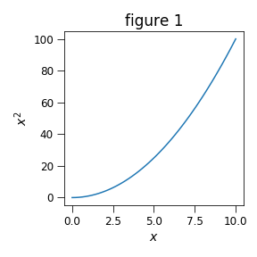
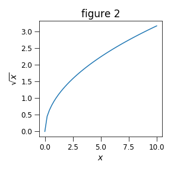

## Demonstrate docstring formatting
### Function generating figures and table output

Note the value of the arg `xlim = (0, 10)`

* Display head of the dataframe

<table border="1" class="dataframe">
  <thead>
    <tr style="text-align: right;">
      <th></th>
      <th>x</th>
      <th>xx</th>
      <th>sqrtx</th>
    </tr>
  </thead>
  <tbody>
    <tr>
      <th>0</th>
      <td>0.000</td>
      <td>0.000</td>
      <td>0.000</td>
    </tr>
    <tr>
      <th>1</th>
      <td>0.204</td>
      <td>0.042</td>
      <td>0.452</td>
    </tr>
    <tr>
      <th>2</th>
      <td>0.408</td>
      <td>0.167</td>
      <td>0.639</td>
    </tr>
    <tr>
      <th>3</th>
      <td>0.612</td>
      <td>0.375</td>
      <td>0.782</td>
    </tr>
    <tr>
      <th>4</th>
      <td>0.816</td>
      <td>0.666</td>
      <td>0.904</td>
    </tr>
  </tbody>
</table>

* Figure 1
Describe analysis for this figure here.
<figure>  <figcaption>Example caption for Fig. 1, which
            shows $x^2$ vs. $x$.    
            
A second caption line.</figcaption></figure>
Interpret results for Fig. 1.  

* Figure 2
A second figure!
<figure>  <figcaption></figcaption></figure>
This figure is a sqrt

---
Check value of the kwarg *test* passed to the formatter: it is "99.00".

---
Insert some latex to test that it passes unrecognized entries on.
    \begin{align*}
    \sin(\theta)^2 + \cos(\theta)^2 =1
    \end{align*}
An inline formula: $\frac{1}{2}=0.5$
---
Finished!
